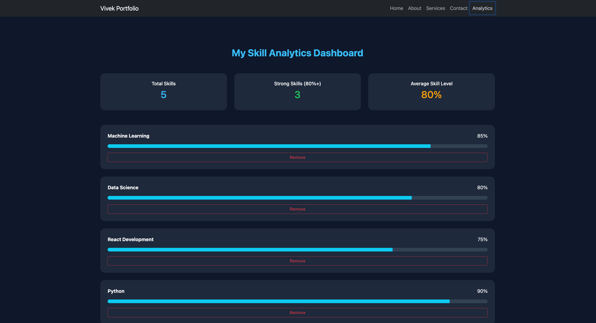
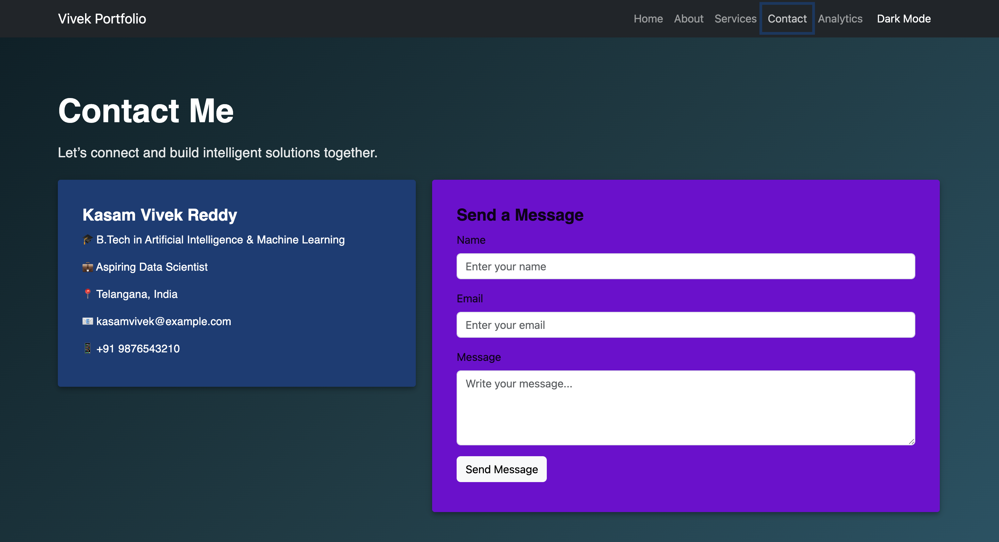
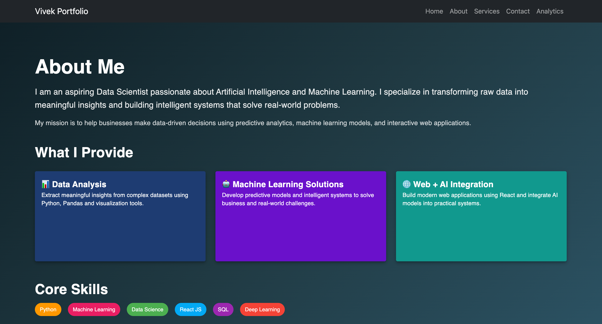
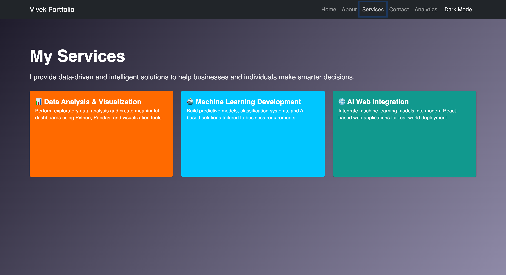

# Experiment 4 - React Hooks: useContext, useReducer, useMemo

## 🚀 Live Demo
[24BAI70214-4-kasamvivek-reddy.vercel.app](https://24bai70214-4-kasamvivek-reddy.vercel.app)

## 📌 Overview
This experiment is an extension of Experiment 3 (Multi-page React application using React Router).

Experiment 4 enhances the application by implementing global state management and performance optimization using advanced React Hooks.

## ✨ New Features Added in Experiment 4
- ✅ `useContext` – Implemented Context API for global state management
- ✅ `useReducer` – Structured state handling with multiple reducer actions
- ✅ `useMemo` – Optimized performance for derived calculations
- ✅ New Analytics Page added using React Router
- ✅ Dynamic Skill Dashboard with real-time calculations

## 📁 Folder Structure
src/
├── components/
│ ├── Navbar.jsx
│ └── ThemeToggle.jsx
├── context/
│ └── AppContext.jsx
├── reducer/
│ └── appReducer.js
├── pages/
│ ├── Home.jsx
│ ├── About.jsx
│ ├── Contact.jsx
│ ├── Services.jsx
│ └── Analytics.jsx
├── App.jsx
├── App.css
└── index.css

## 📸 Screenshots

### 🏠 Home Page

### 📊 Analytics Page

### 📩 Contact Page

### 👤 About Page

### 🛠 Services Page

## 🛠️ Tech Stack
- React.js
- React Router DOM
- Context API (`useContext`)
- useReducer
- useMemo
- React Bootstrap
- CSS

## 👤 Author
- **Name:** Kasam Vivek Reddy
- **UID:** 24BAI70214
- **Course:** B.Tech Artificial Intelligence
